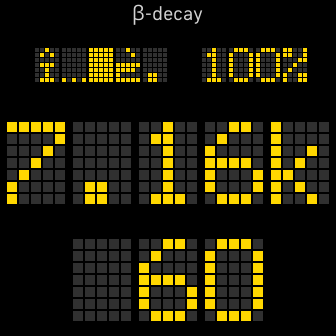
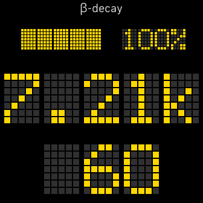
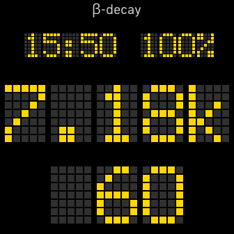
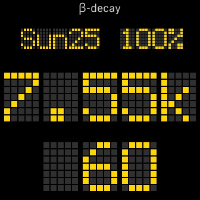
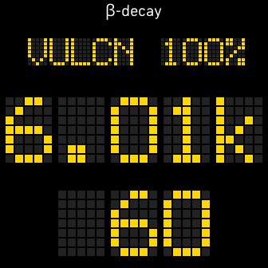
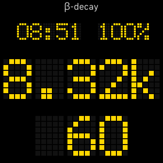
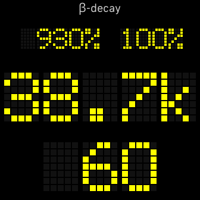
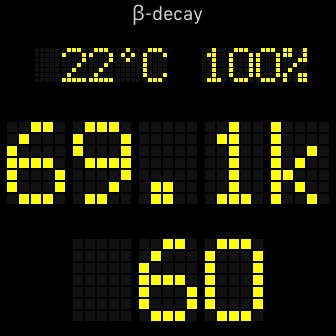
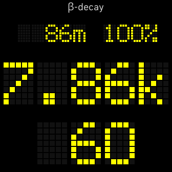

- [Features](#features)
  - [Time](#time)
  - [Steps](#steps)
  - [Heart Rate](#heart-rate)
  - [Battery Level](#battery-level)
  - [Complications](#complications)
    - [Glitch](#glitch)
    - [None](#none)
    - [Time](#time-1)
    - [Date](#date)
    - [Model](#model)
    - [Time to Sunset or Sunrise](#time-to-sunset-or-sunrise)
    - [Main Goal Progress](#main-goal-progress)
    - [Weather](#weather)
    - [Altitude](#altitude)
- [Background](#background)
- [Licensing](#licensing)
- [Developer Stuff](#developer-stuff)
  - [Names](#names)
  - [Fonts](#fonts)
    - [Dot-matrix](#dot-matrix)
    - [16-Segment](#16-segment)
  - [Local settings location](#local-settings-location)
  - [Setup](#setup)
    - [Generate Fonts](#generate-fonts)
    - [Setup for Sideloading](#setup-for-sideloading)
  - [Changelog](#changelog)

# Features



## Time

Or lack thereof. I don't actually care about seeing the time on my fitbit. I have a watch I use for that. See the [Background Section](#background) for details. I have also added a time complication, if someone not in my situation wants it.

## Steps

Steps are front and center. I may change this to be the primary goal. For the time being, this is not configurable. After `999` steps, it will display as `1.00k`. After `9999` steps, it will display as `10.0k`. I'm assuming nobody will get 100k steps in a day. If you do, [IT'S TIME TO STOP!](https://youtu.be/x0dHUXLmSYQ)

## Heart Rate

Heart rate is the secondary stat, on the bottom. This is not configurable, and I do not have any plans to make it so.

## Battery Level

Its a useful stat, in the top right. This is not configurable, and I do not have any plans to make it so.

## Complications

Admittedly, this is a complete afterthought. While mocking up the UI, I felt that this area needed _something_, but I didn't have a good sense of what _I_ wanted there. So, I decided to make it a single selection of the following:

### Glitch

Once per tick, a random selection of all the characters in the dot-matrix font is displayed. There is no great meaning here. It's gibberish.


### None

The complication is filled with full blocks; "█"



### Time

Self explanatory. As much as I don't care about it, others might. The format takes into account user's time format setting.



### Date

Self explanatory. The format is configurable within the Date Format menu. I think all desired formats that can fit in 5 characters for any day of the year are present. If you think one is missing or would like another, just ask.



### Model

The detected model. Configurable to truncated, squished, or codename. Truncated cuts off anything after the 5th character; e.g., A Versa 3 would show `VERSA`. Squished will reformat the name, including revision to fit inside 5 characters; e.g., Sense 2 would show `VRSA3`. Codename is the internal Codename FitBit uses for the model; e.g., Versa 3 is `ATLAS`.



### Time to Sunset or Sunrise

Does what it says on the tin. Updates periodically; configurable from 30 minutes to 3 hours. There may be a slight innacuracy immediately after sunset due to it using the current day's sunrise time instead of tomorrow's. Within a minute or 2, it should re-query for it, and update itself. This will be the most pronounced on the [biannual equinoxes](https://en.wikipedia.org/wiki/Equinox). (around March 20th, and September 23rd)

Powered by [SunriseSunset.io](https://sunrisesunset.io/api/).



### Main Goal Progress

A percentage representing your current progress towards your daily goal.



### Weather

Just the local temperature, in your preferred units.



### Altitude

The altitude, in preferred units, using the barometric equation.  This uses the current pressure and the outside temperature to calculate the value.  This should not be considered especially accurate.



# Background

I wanted a watch face that was basically just steps and heart rate. I already have a really nice watch, and didn't want to not use it. Also, I've had terrible luck with FitBits breaking 30s after the 1y warranty expires.

The name comes from the aforementioned watch. It uses small tritium vials for illumination; [Tritium radioluminescence](https://en.wikipedia.org/wiki/Tritium_radioluminescence) relies on the beta-decay of tritium, hence the name. (β-decay)

# Licensing

I currntly intend to add a payment gate to this code. However, if you're reading this, ask nicely, and I might send a discount code ;)

To the best of my knowledge, all external resources (e.g. fonts) permit commercial use.

# Developer Stuff

## Names

| display type | platform    | cost | description/name           | alt name               |
| ------------ | ----------- | ---- | -------------------------- | ---------------------- |
| dot-matrix   | hera / rhea | paid | beta-decay                 | beta-decay (v2)        |
| dot-matrix   | hera / rhea | free | beta-decay (free)          | beta-decay (v2, free)  |
| dot-matrix   | older       | paid | beta-decay (legacy)        | beta-decay             |
| dot-matrix   | older       | free | beta-decay (legacy, free)  | beta-decay             |
| 16-segment   | hera / rhea | paid | alpha-decay                | alpha-decay (v2)       |
| 16-segment   | hera / rhea | free | alpha-decay (free)         | alpha-decay (v2, free) |
| 16-segment   | older       | paid | alpha-decay (legacy)       | alpha-decay            |
| 16-segment   | older       | free | alpha-decay (legacy, free) | alpha-decay            |

## Fonts

Font-Image generation is covered [here](#generate-fonts).

### Dot-matrix

Official name is Repetition Scrolling. These heights are useful for determining positioning.

| font size | width | height |
| --------- | ----- | ------ |
| 120       | 66    | 82     |
| 100       | 55    | 69     |
| 50        | 28    | 35     |

### 16-Segment

TODO

## Local settings location

my local settings path is `C:\Users\drake\AppData\Roaming\Fitbit OS Simulator\vulcan\companion\app_72f2cf03-6f6e-4e60-b834-feca06a79361\settingsstorage`

## Setup

Perform the [general install instructions](https://dev.fitbit.com/getting-started/) as specified in the getting started guide, then run the following command in the specified folders. Note: I do not have a folder with the entire watchface, as specified in the guide.

    npm install .

 - `common/`
 - `beta-decay-legacy`
 - `beta-decay-v2`

### Generate Fonts

The following are 2 example commands for generating fitfont images. note, the second (with the cat command) only works on linux.

    npx fitfont-generate ..\fonts\repetition-scrolling\repet___.ttf 120 █1234567890.k-
    npx fitfont-generate ..\fonts\repetition-scrolling\repet___.ttf 50 $(cat chars.txt)

To crispen the images, reducing them to purely black/white, run the following command on linux:

    find . -path "*.png" -exec convert '{}' -posterize 2 '{}' \;

### Setup for Sideloading

Before sideloading, please note the 2 following sections of `package.json` which appear to be necessary for said sideloading.

```json
"enableProposedAPI": true
```

```json
"dependencies": {
  "yarn": "^1.22.19",
  "fitfont": "^1.3.3",
  "@fitbit/sdk": "~7.1.0-pre.0",
  "@fitbit/sdk-cli": "~1.8.0-pre.10",
  "@fitbit/sdk-build-targets": "cmengler/fitbit-sdk-build-targets"
}
```

`sideload.sh` should accomplish the following:

1.  recursively delete `package-lock.json`, `yarn.lock`, `app/`, `build/`, `companion/`, `node_modules/`, `resources/`, and `settings/`.
2.  recursively copy `app/`, `companion/`, `resources/`, and `settings/` into destination.
3.  cd destination
4.  run the following commands:

        yarn install
        yarn build
        export FITBIT_QA_COMMANDS=1
        yarn debug

5.  manually run the following commands on the `fitbt$` prompt:

        hosts
        connect phone
        connect device
        build-and-install

## Changelog

| Version | date       | JIRA cards                             | Description                                     |
| ------- | ---------- | -------------------------------------- | ----------------------------------------------- |
| 0.1.0   | 2023-07-01 | ??                                     | more advanced version ready to sidelaod         |
| 0.1.1   | 2023-07-02 | n/a                                    | changes to get sideloading working              |
| 0.1.2   | 2023-07-03 | COD-28, COD-29, COD-30, COD-31, COD-32 | bugfixes found during sideloading               |
| 0.1.3   | 2023-07-04 | COD-35                                 | fixing issue where time to sunrise said `15:-7` |
| 0.2.0   | 2023-07-04 | COD-34                                 | scrolling glitch                                |
| 0.3.0   | 2023-07-04 | COD-27                                 | custom (hex) colors                             |
| 0.4.0   | 2023-07-04 | COD-19                                 | goal progress complication                      |
| 0.5.0   | 2023-07-04 | COD-15                                 | weather (temperature) complication              |
| 0.6.0   | 2023-07-04 | COD-14                                 | altitude complication                           |
